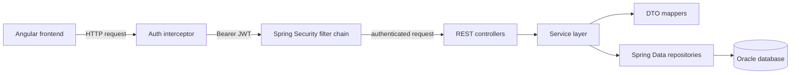

# EOS Task Management Platform

EOS is a full-stack task-management application built during a Java full-stack internship. It lets teams assign work, track progress, discuss tasks and receive notifications in one place.

The project connects an Angular client to a Spring Boot REST API and an Oracle database. The repository is intentionally kept as a practical internship project: the code is split into understandable modules and the main request flows can be followed from the UI to the database.

## What the application demonstrates

- Building a complete feature across frontend, REST API and relational database layers.
- Separating UI components, HTTP services, controllers, business logic, persistence and DTO mapping.
- Implementing authentication and database-driven authorization instead of relying only on frontend controls.
- Handling realistic task flows such as assignment, status changes, comments and notifications.
- Using server-side pagination so list endpoints return only the requested page.

## Main Features

- Login and registration with JWT authentication.
- Personal, assigned-task and all-task views.
- Task creation, full updates, status updates and deletion.
- Task body/description, due dates and status types.
- Search, sorting and server-side pagination for tasks and users.
- Database-backed `USER`, `ADMIN` and `SUPER_ADMIN` roles.
- Configurable role-permission relationships and protected user administration.
- Task conversations with comment ownership checks.
- Notifications for task assignments and new comments.
- Reusable Angular dialogs, route guards and an HTTP authentication interceptor.

## Technical Stack

### Frontend

- Angular 21
- TypeScript, HTML and CSS
- Angular Router and route guards
- `HttpClient`, HTTP interceptor and RxJS observables
- Angular forms, two-way binding and reusable child components

### Backend

- Java 21
- Spring Boot and Spring Web MVC
- Spring Data JPA and Hibernate
- Spring Security
- Bean Validation
- Lombok
- jose4j for JWT processing
- Maven

### Database and testing

- Oracle Database
- Relational role/permission model
- JPA entity relationships and schema validation
- JUnit service tests

## Architecture



The backend follows a simple layered structure:

- `controller` exposes REST endpoints and validates incoming request bodies.
- `service` contains business rules, ownership checks and transaction boundaries.
- `repository` handles database access through Spring Data JPA.
- `domain` contains JPA entities mapped to the Oracle schema.
- `dto` defines the smaller objects exchanged through the API.
- `mapper` converts between JPA entities and DTOs.
- `config` contains JWT filtering, CORS, Spring Security and permission logic.

## Important Technical Flows

### Creating and assigning a task

The Angular task form emits a task model to the parent component. The frontend service sends it to `POST /tasks`; the interceptor adds the JWT. The backend validates the DTO, loads the assigned user and status from the database, creates the entity, saves the task, creates the assignment notification and returns a response DTO.

### Comments and notifications

Comments are linked to both a task and its author. The backend checks task access and comment ownership, then saves the comment and notifies the other participant in the conversation. The frontend updates the local list with the returned DTO and can mark the notification as read through a separate `PATCH` request.

### Pagination and filtering

The frontend sends page, size, view and sort parameters. The backend creates a Spring Data `Pageable`, selects the correct task set based on the authenticated user's role, queries only the requested page and returns the content together with total element/page information.

## Security Model

- `/login` and `/register` are public endpoints.
- Other endpoints require an authenticated JWT.
- The JWT filter verifies the token and makes the authenticated user id available through Spring Security's context.
- `PermissionChecker` loads the current user and role permissions from the database.
- Regular users can access only their assigned tasks and update their task status.
- Administrators can manage tasks according to their permissions.
- `SUPER_ADMIN` is required for operations involving administrator accounts.
- Ownership is checked for tasks, comments and notifications in the backend, even when the request does not come from the Angular UI.

## Repository Layout

```text
frontend/     Angular application
backend/      Spring Boot REST API
docs/         Architecture notes and application screenshots
```

## Screenshots

The screenshots use representative demo data and show the main application flows.

### Task board


### New task


### Search and administration


### Conversations and notifications


## Running the Application

### Backend

1. Copy `backend/src/main/resources/application.properties.example` to `backend/src/main/resources/application.properties`.
2. Set the local Oracle connection values and JWT secret.
3. Start the API:

```powershell
cd backend
./mvnw spring-boot:run
```

The API runs on `http://localhost:8080` by default.

### Frontend

```powershell
cd frontend
npm install
npm start
```

The Angular application runs on `http://localhost:4200` and calls the backend on port `8080`.

## Documentation

- [Frontend README](frontend/README.md)
- [Backend README](backend/README.md)
- [Architecture notes](docs/architecture.md)

## Configuration Safety

Real database credentials and JWT secrets are intentionally excluded. Keep local configuration in `application.properties`, which is ignored by Git.
