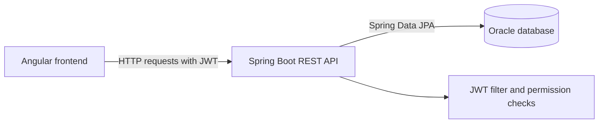
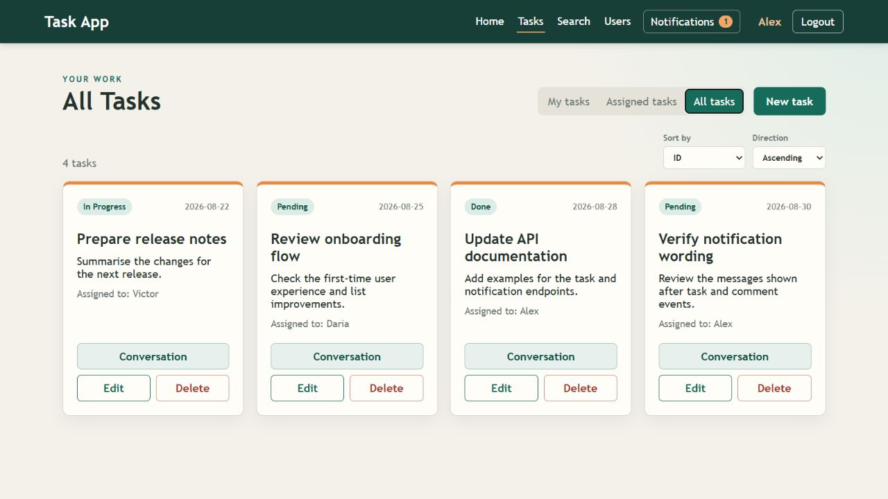
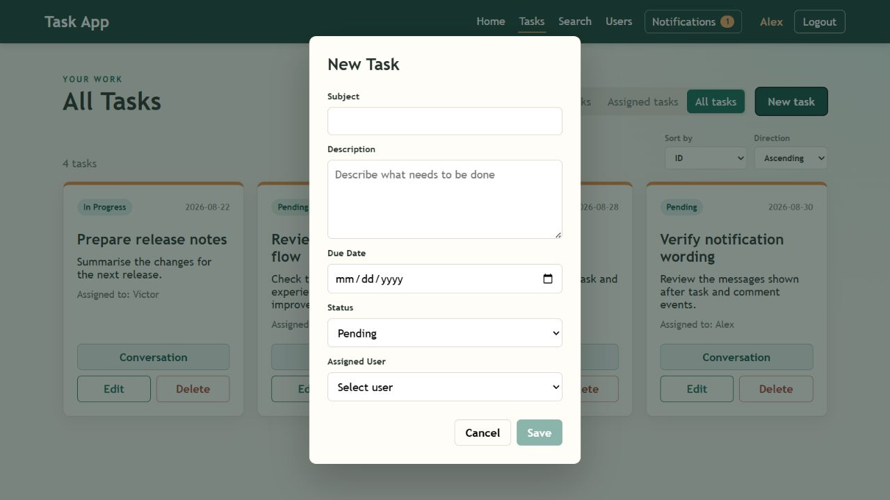
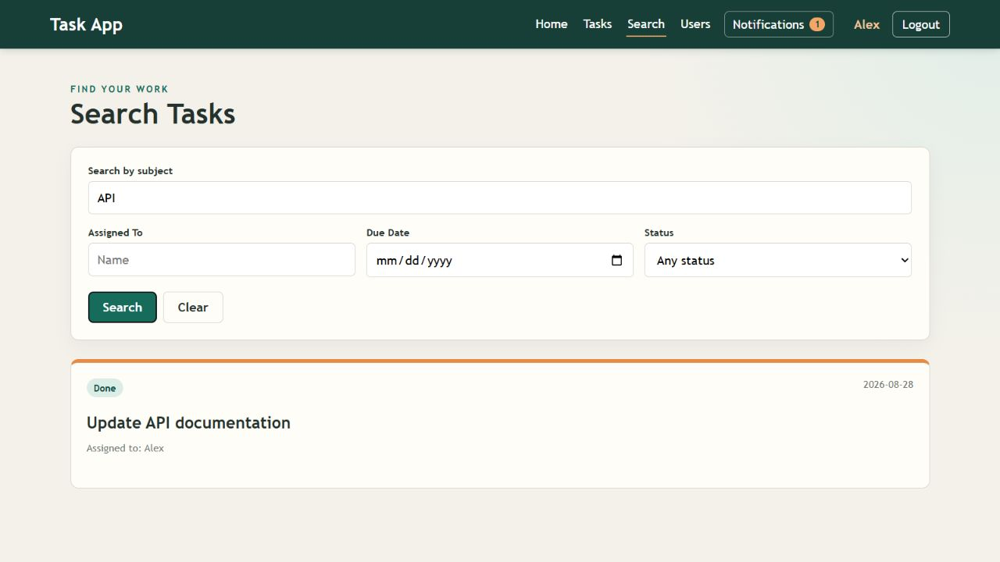
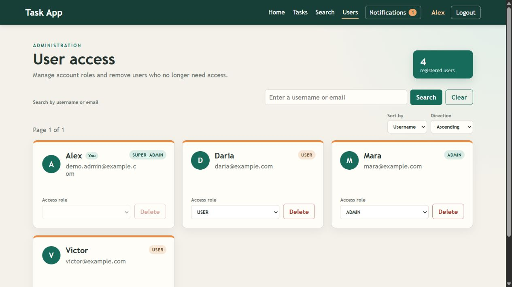
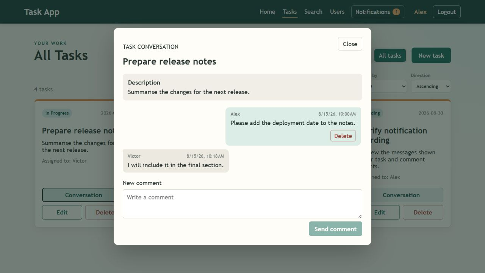
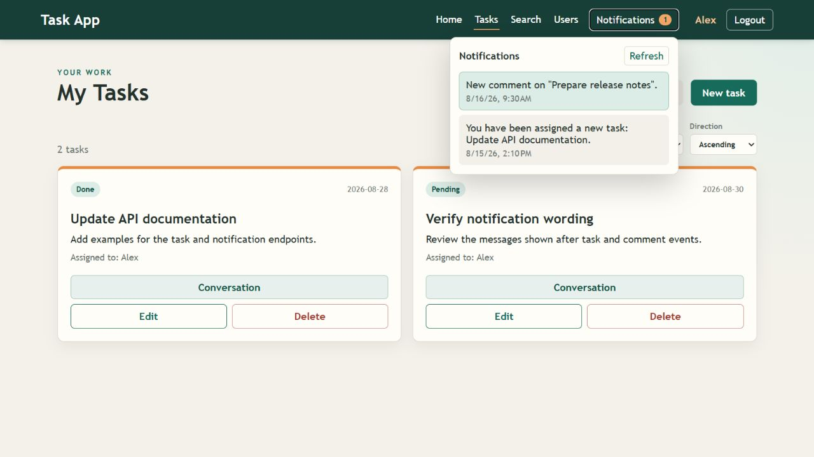

# EOS Task Management Platform

Full-stack task-management application built with an Angular frontend, a Spring Boot REST API and an Oracle database.

The application supports role-based task management for `USER`, `ADMIN` and `SUPER_ADMIN` accounts, task conversations, notifications and server-side pagination.

## Repository Layout

```text
frontend/     Angular application
backend/      Spring Boot REST API
docs/         Architecture notes and application screenshots
```

## Main Features

- Login and registration with JWT authentication.
- Personal, assigned and all-task views.
- Task creation, full updates, status updates and deletion.
- Server-side pagination, sorting and task search.
- Role-based permissions backed by database tables.
- User administration with protection for privileged accounts.
- Task conversations with comments and ownership checks.
- Notifications for task assignments and new comments.
- Reusable Angular dialogs, route guards and HTTP authentication interceptor.

## Architecture



The backend uses a simple layered structure:

- `controller` exposes REST endpoints and validates requests.
- `service` contains business rules, access checks and transaction boundaries.
- `repository` handles database access through Spring Data JPA.
- `domain` maps Java entities to the Oracle schema.
- `dto` defines the data exchanged with the frontend.
- `mapper` converts between entities and DTOs.
- `config` contains JWT, CORS, Spring Security and permission logic.

## Security Model

- `/login` and `/register` are public endpoints.
- Other endpoints require an authenticated JWT.
- The backend loads the current user from the authenticated JWT identity and database.
- Permissions are checked against the role-permission tables.
- Regular users can access only their assigned tasks and update their status.
- Administrators can manage tasks according to their permissions.
- `SUPER_ADMIN` is required for operations involving administrator accounts.
- Ownership is checked for tasks, comments and notifications in the backend.

## Screenshots

The screenshots use representative demo data and show the main application flows.

### Task board



### New task



### Search and administration





### Conversations and notifications





## Running the Application

### Backend

1. Copy `backend/src/main/resources/application.properties.example` to `backend/src/main/resources/application.properties`.
2. Set the Oracle connection values and a long JWT secret.
3. Start the API:

```powershell
cd backend
./mvnw spring-boot:run
```

The API runs on `http://localhost:8080` by default.

### Frontend

```powershell
cd frontend
npm install
npm start
```

The Angular application runs on `http://localhost:4200` and calls the backend on port `8080`.

## Documentation

- [Frontend README](frontend/README.md)
- [Backend README](backend/README.md)
- [Architecture notes](docs/architecture.md)

## Configuration Safety

Real database credentials and JWT secrets are intentionally excluded. Keep local configuration in `application.properties`, which is ignored by Git.
